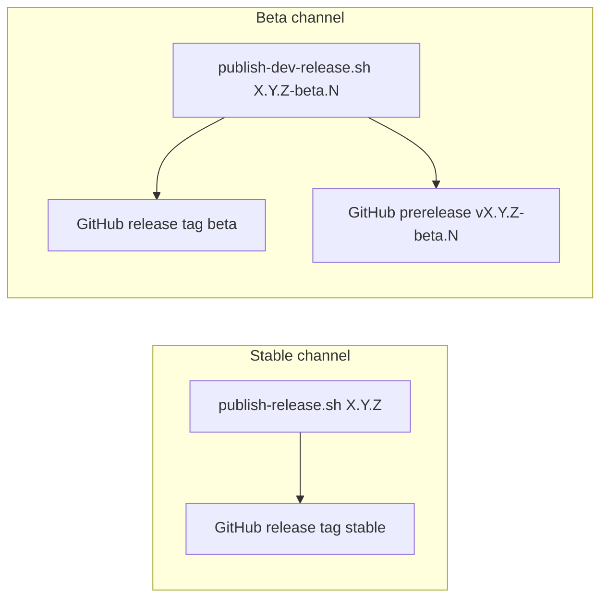

# Spinosa Framework Release Guide

> **Agent-owned document.** Never committed to git. Read this before cutting a release.

---

## Release channels (overview)

Spinosa ships on two **independent** release channels. They share the same GitHub repo and asset layout (7 files per release) but differ in how users discover and install them.

| Channel | Audience | GitHub endpoint | `spinosa upgrade` |
| ------- | -------- | --------------- | ----------------- |
| **Stable** | Production users, docs, marketing | `releases/download/stable/install.sh` (non-prerelease only) | `spinosa upgrade` (default) |
| **Beta** | Maintainers, early testers | `releases/download/beta/install.sh` (rolling tag) | `spinosa upgrade --channel beta` |

**Invariant:** Publishing a beta prerelease never changes the rolling `stable` endpoint. Docs and marketing always point at the **stable** GitHub endpoint.



### Install commands (end users)

**Stable** (production):

```bash
curl -fsSL https://github.com/TommasoPrinetti/spinosa/releases/download/stable/install.sh | bash
```

**Beta** (rolling channel — updated on each beta publish):

```bash
curl -fsSL https://github.com/TommasoPrinetti/spinosa/releases/download/beta/install.sh | bash
```

**Pin a specific tag** (stable or beta):

```bash
curl -fsSL https://github.com/TommasoPrinetti/spinosa/releases/download/vX.Y.Z/install.sh | bash
curl -fsSL https://github.com/TommasoPrinetti/spinosa/releases/download/v0.8.0-beta.1/install.sh | bash
```

After `curl | bash`, reload PATH:

```bash
source ~/.zshrc          # macOS default
# or: source ~/.spinosa/env.sh
```

### Upgrade commands (end users)

```bash
spinosa upgrade --yes                      # stable latest
spinosa upgrade --channel beta --yes        # beta latest (newest beta prerelease)
spinosa upgrade --version 0.8.0-beta.1     # pin exact tag (any channel)
```

Auto-upgrade prompts on `spinosa` startup use the **stable** channel only. Beta testers opt in explicitly.

Optional env:

```bash
export SPINOSA_RELEASE_CHANNEL=beta   # default for explicit --channel-less tooling only
```

### Rolling `beta` release (GitHub)

Each `publish-dev-release.sh` run:

1. Publishes the semver prerelease tag (e.g. `v0.8.0-beta.1`) with 7 assets.
2. Syncs a separate GitHub release tagged **`beta`** at the same commit — assets clobbered, tag force-moved.

Users curl `releases/download/beta/install.sh` for the newest beta without knowing the semver tag. `spinosa upgrade --channel beta` resolves the pin from that same URL.

---

## Version naming

| Channel | Format | Example tag | `PINNED_VERSION` in `install.sh` |
| ------- | ------ | ----------- | -------------------------------- |
| Stable | `X.Y.Z` | `v0.7.7` | `0.7.7` |
| Beta | `X.Y.Z-<prerelease>` | `v0.8.0-beta.1` | `0.8.0-beta.1` |

**Rules enforced by publish scripts:**

- Stable: `bash .bin/publish-release.sh` accepts `X.Y.Z` only.
- Beta: `bash .bin/publish-dev-release.sh` accepts `X.Y.Z-beta.N` (or similar suffix with `-`).
- `PINNED_VERSION` in `install.sh` **must match** the version you publish (checked before upload).

Bump `PINNED_VERSION` as the **last code change** before every publish (stable or beta).

---


## Prerequisites

- `gh` CLI installed and authenticated
- Clean working tree (`git status --porcelain` — move untracked files to `.trash/temp/` temporarily)

> **No Python/vendor build step required.**  `markitdown-ts` and `ppu-paddle-ocr` are Bun/TS
> packages installed through npm.  The framework ships `install.sh` without vendor tarballs.
> The `--no-bundled-tools` flag is now the default — the entire Python vendor section was
> removed in v0.8.0-beta.12.

---

## Stable release (production)

Use for every production ship. Full testsuite sign-off recommended (see [docs/reference/testsuite.md](docs/reference/testsuite.md)).

### 1. Implement fixes or features

Make all source changes. The framework archive includes everything tracked in `framework/spinosa/framework-files.tsv`.

### 2. Bump version

```bash
# package.json — "version" field
jq '.version' package.json   # verify current
# Edit manually or: npm version 0.8.0 --no-git-tag-version
```

The canonical version lives in root `package.json`. `install.sh` uses a `__VERSION__`
placeholder that is rewritten to the actual version by `package-release.sh` at build time.

Update fallback URLs on lines 19–20 if they reference a stale version.

### 3. Run the pre-release test suite

**Canonical checklist:** [docs/reference/testsuite.md](docs/reference/testsuite.md)

Minimum automated gate (Phase A — run before packaging):

```bash
bash .bin/check-startup.sh
bash .bin/check-doc-contract.sh
bash .bin/validate-skills.sh
bash -n .bin/spinosa
bash -n .bin/package-release.sh
bash -n .bin/publish-release.sh
bash -n .bin/publish-dev-release.sh
bash -n install.sh
bash .bin/test-doctor.sh
bash .bin/test-safe-copy.sh
```

Phases B–G (install, interactive CLI, workspace, Linux VM, GitHub assets) are **blocking** for production stable releases.

If any blocking phase fails, do not package or publish.

### 4. Commit

```bash
git add -A
git commit -m "release: vX.Y.Z" -m "<summary of changes since last version>"
```

### 5. Vendor tarballs (removed)

Vendor tarballs (Python runtime + pip packages) were removed in v0.8.0-beta.12.
`markitdown-ts` and `ppu-paddle-ocr` are pure Bun/TS packages.  No Python is shipped
or required.  `build-spinosa-vendor.sh` is retired.

If publishing a stable release from an older tag that still needs vendor tarballs:

```bash
bash .bin/build-spinosa-vendor.sh darwin-arm64
bash .bin/build-spinosa-vendor.sh darwin-amd64
bash .bin/build-spinosa-vendor.sh linux-amd64
bash .bin/build-spinosa-vendor.sh linux-arm64
```

This downloads standalone Python 3.11.15 + CLI wrappers per platform (~25–48 MB each).

### 6. Ensure clean working tree

```bash
git status --porcelain
# Move any untracked files out of the way:
# mv untracked-dir .trash/temp/
```

### 7. Publish stable

```bash
bash .bin/publish-release.sh X.Y.Z
```

Optional: replace assets on an existing tag (same commit only):

```bash
bash .bin/publish-release.sh X.Y.Z --replace-assets
```

This runs `package-release.sh` internally, which:

- Reads `framework/spinosa/framework-files.tsv` to assemble the tarball
- Stages `install.sh` and checksums
- Copies vendor tarballs into `dist/vX.Y.Z/` (no-op since v0.8.0-beta.12 — no tarballs shipped)
- Creates the GitHub release via `gh release create` (not marked prerelease)
- Uploads assets (install.sh + framework tarball + checksums)

Stable publish refreshes the rolling **`stable`** release. Verify:

```bash
curl -fsSL https://github.com/TommasoPrinetti/spinosa/releases/download/stable/install.sh | grep PINNED_VERSION
# must show: PINNED_VERSION="X.Y.Z"
```

### 8. Verify GitHub assets (stable)

```bash
curl -sL "https://api.github.com/repos/TommasoPrinetti/spinosa/releases/tags/vX.Y.Z" | \
  python3 -c "import json,sys; r=json.load(sys.stdin); [print(f'  {a[\"name\"]:50s} {a[\"size\"]:>15,} bytes  {a[\"state\"]}') for a in r['assets']]"
```

Expected assets (all `uploaded`):

- `spinosa-framework-X.Y.Z.tar.gz`
- `install.sh`
- `checksums.txt`

> Vendor tarballs (`spinosa-vendor-*.tar.gz`) are no longer shipped since v0.8.0-beta.12.
---

## Beta release (prerelease)

Use to test installers and upgrades **before** a stable cut. Safe to publish from a feature branch; does not affect production `stable`.

### When to use

- Validate `spinosa upgrade` + `spinosa update` on cloud workspaces before stable
- Share a curl-able build with testers without changing the website stable command
- Iterate quickly on `fix/*` or beta branches

### Workflow

1. **Implement** changes on your branch (same as stable step 1).

2. **Bump version** in `package.json`:

   ```json
   "version": "0.8.0-beta.1"
   ```

3. **Commit** (beta releases still require a clean tree):

   ```bash
   git add -A
   git commit -m "release: v0.8.0-beta.1"
   ```

4. **Run Phase A** (minimum — full testsuite optional but recommended):

   ```bash
   bash .bin/check-startup.sh
   bash -n .bin/spinosa
   bash -n .bin/publish-dev-release.sh
   bash .bin/test-doctor.sh
   ```

4a. **Build and publish TUI binary to npm**:

   The TUI (opencode fork + spinosa enhancements) ships as a standalone npm package.
   The installer runs `bun install -g @spinosa/tui` after framework extraction.

   ```bash
   # Build platform binaries for all targets
   bun run script/build-tui.ts

   # Publish to npm (requires @spinosa org access)
   bun run script/publish-tui.ts
   ```

   This compiles packages/opencode + packages/tui + packages/spinosa-core into
   standalone binaries for 12 platform targets (~80-120 MB each).
   Platform packages are auto-resolved via optionalDependencies.

5. **Publish beta**:

   ```bash
   bash .bin/publish-dev-release.sh 0.8.0-beta.1
   ```

   Equivalent:

   ```bash
   bash .bin/publish-release.sh 0.8.0-beta.1 --prerelease
   ```

   Creates a GitHub release with `--prerelease`. Same 7 assets as stable.

6. **Verify beta endpoint**:

   ```bash
   curl -fsSL https://github.com/TommasoPrinetti/spinosa/releases/download/beta/install.sh | grep PINNED_VERSION
   # must show: PINNED_VERSION="0.8.0-beta.N"
   ```

7. **Test install** (fresh machine or VM):

   ```bash
   curl -fsSL https://github.com/TommasoPrinetti/spinosa/releases/download/beta/install.sh | bash
   spinosa version
   spinosa doctor
   ```

8. **Test upgrade path** (from an older stable):

   ```bash
   spinosa upgrade --channel beta --yes
   ```

### Beta versioning tips

- Increment beta serial: `0.8.0-beta.1` → `0.8.0-beta.2` for each beta publish.
- When ready for stable, publish `0.8.0` with `publish-release.sh` (no `-beta` suffix).
- Multiple prereleases can coexist on GitHub; the rolling `beta` tag always tracks the **last** `publish-dev-release.sh` run.

### Replacing beta assets

```bash
bash .bin/publish-dev-release.sh 0.8.0-beta.1 --replace-assets
```

Same rules as stable: tag must point at current `HEAD`.

---

## Linux VM testdrive (pre-stable validation)

Run on a **fresh Linux VM** (Ubuntu 22.04+, amd64 or arm64) before a **stable** release goes live. Optional for beta prereleases.

### Install from local build

```bash
cd /tmp
tar -xzf spinosa-framework-X.Y.Z.tar.gz
bash spinosa-framework-X.Y.Z/install.sh --yes
source ~/.bashrc
```

### Install from beta endpoint

```bash
curl -fsSL https://github.com/TommasoPrinetti/spinosa/releases/download/beta/install.sh | bash
source ~/.bashrc
spinosa version
```

### Prepare test corpus

```bash
rsync -avz user@mac-host:/Users/tommasoprinetti/Downloads/TEST-VAULT/ /tmp/TEST-VAULT/
```

### Create testdrive workspaces

```bash
SPINOSA_TEST_VAULT=/tmp/TEST-VAULT bash .bin/test-new-test-vault.sh
```

See testsuite Phase F and section 9c in prior revisions for full edge-case matrix (PDF-only, JPG-only, unicode paths, etc.).

### Blockers

If any blocking test fails, **do not publish stable**. Fix, bump version, re-run.

---

## Files & their roles

| File | Purpose |
| ---- | ------- |
| `install.sh` | End-user installer; `PINNED_VERSION` must match published version |
| `RELEASE_GUIDE.md` | This document — operator checklist (not shipped to users) |
| `framework/spinosa/framework-files.tsv` | Manifest of files in the framework tarball |
| `framework/bin/package-release.sh` | Builds tarball + checksums; accepts `X.Y.Z` and `X.Y.Z-beta.N` |
| `framework/bin/publish-release.sh` | Stable publish; `--prerelease` for beta; `--replace-assets` to clobber |
| `framework/bin/publish-dev-release.sh` | Thin wrapper → `publish-release.sh … --prerelease` |
| `framework/bin/lib/spinosa/release_channels.sh` | Channel resolution (`stable` / `beta`), install URL helpers |
| `framework/bin/build-spinosa-vendor.sh` | Per-platform vendor tarballs |
| `docs/reference/testsuite.md` | Full pre-release gate (Phases A–G) |
| `docs/reference/cli.md` | User-facing `upgrade --channel beta` docs |


---

## Gotchas

### Publishing

- **Clean tree required:** `publish-release.sh` refuses dirty `git status --porcelain`. Stow untracked files in `.trash/temp/`.
- **`PINNED_VERSION` must match:** publish scripts exit if `install.sh` pin ≠ release version.
- **`dist/` is gitignored:** bundles land in `dist/vX.Y.Z/` or `dist/vX.Y.Z-beta.N/` — never committed.
- **Vendor tarballs are gitignored:** copied from `framework/bin/lib/vendor/` at publish time.
- **Package from disk, not tag:** commit before publish; the archive reflects current checkout.
- **Beta does not move `stable`:** only stable releases refresh the rolling `stable` endpoint.

### Upgrade / install

- **`curl | bash` installs the pin inside `install.sh`**, not necessarily the newest binaries unless you pass `--latest` to the installer or run `spinosa upgrade`.
- **`spinosa upgrade` re-execs** after install (v0.7.7+) so post-upgrade workspace sync uses new framework libraries — do not skip workspace update on cloud Drive without syncing first.
- **Auto-upgrade prompts ignore beta channel** — testers use `spinosa upgrade --channel beta` explicitly.
- **`SPINOSA_REPO` is ignored in `cmd_upgrade`** (supply-chain safety) — channel URLs are built-in.

### Cloud workspaces

- Run `spinosa update` only after Google Drive has synced locally.
- Tail `~/.spinosa/logs/spinosa.log` during update; look for `update path=` and `migrate logs/` lines.
- Override timeouts: `SPINOSA_CLOUD_COPY_TIMEOUT_SEC=120 spinosa update --yes`

### Beta channel

- `releases/download/beta/install.sh` returns **404** until the first `publish-dev-release.sh` run (which creates the rolling `beta` release).
- Re-publishing the same beta tag with `--replace-assets` also re-syncs the `beta` channel.

---

## Quick reference

| Task | Command |
| ---- | ------- |
| Publish stable | `bash .bin/publish-release.sh X.Y.Z` |
| Publish beta | `bash .bin/publish-dev-release.sh X.Y.Z-beta.N` |
| Stable install | `curl -fsSL https://github.com/TommasoPrinetti/spinosa/releases/download/stable/install.sh \| bash` |
| Beta install | `curl -fsSL https://github.com/TommasoPrinetti/spinosa/releases/download/beta/install.sh \| bash` |
| Upgrade stable | `spinosa upgrade --yes` |
| Upgrade beta | `spinosa upgrade --channel beta --yes` |
| Verify stable pin | `curl -fsSL …/releases/download/stable/install.sh \| grep PINNED_VERSION` |
| Verify beta pin | `curl -fsSL …/releases/download/beta/install.sh \| grep PINNED_VERSION` |
| List release assets | `gh release view vX.Y.Z` |
| Package only (no upload) | `bash .bin/package-release.sh X.Y.Z` |

---

## Restore stashed files

```bash
mv .trash/temp/* . 2>/dev/null; rmdir .trash/temp 2>/dev/null
```
